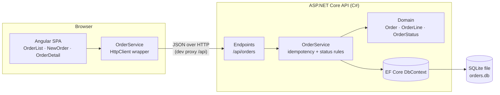
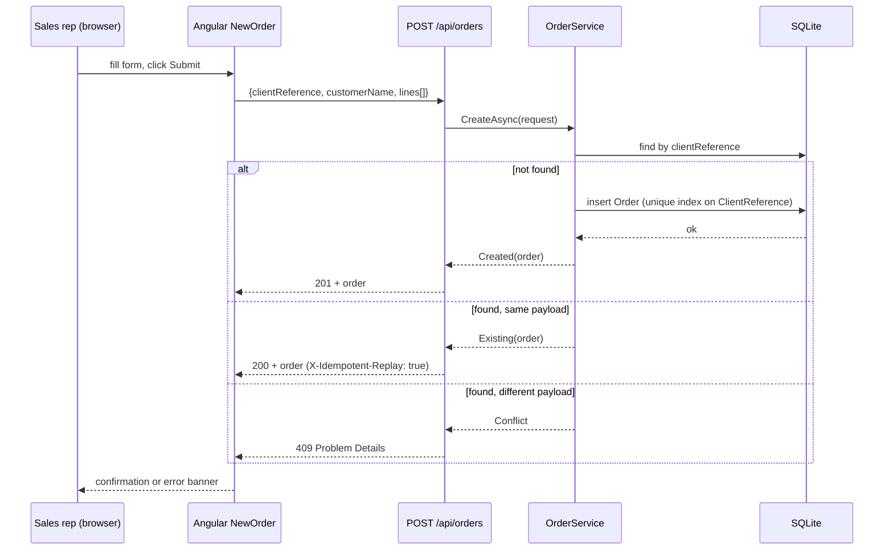
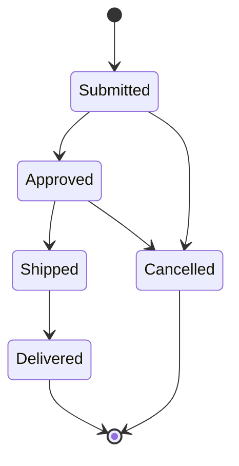
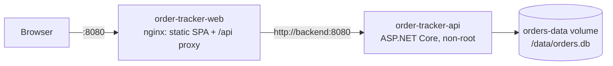

# Architecture

## Overview

Order Tracker is a small internal web application with two deployable parts:

| Part | Technology | Responsibility |
|------|-----------|----------------|
| Frontend | Angular 22 (standalone components, signals) | Order entry form, order list, order detail / status updates |
| Backend | ASP.NET Core 10 Minimal API (C#) | REST API, idempotent order creation, status workflow, persistence |
| Database | SQLite via Entity Framework Core | Durable storage of orders and line items |

The frontend talks to the backend over JSON/HTTP. In development the Angular dev server
proxies `/api/*` to the backend so the browser only ever sees one origin.

## Component diagram

## Request flow: submitting an order

## Idempotency design

The client-provided `clientReference` is the idempotency key.

1. `Order.ClientReference` has a **unique index** in SQLite. This is the hard guarantee: two
   rows with the same reference can never exist, even under concurrent requests.
2. Before inserting, the service looks up the reference. If it exists and the incoming
   payload is **semantically identical** (same customer, same lines), the existing order is
   returned with `200 OK` and an `X-Idempotent-Replay: true` header. The rep sees the order
   "went through" without a duplicate being created.
3. If the reference exists but the payload **differs**, the API returns `409 Conflict` with a
   Problem Details body. Silently returning a different order would hide a data-entry mistake.
4. If two requests race past the lookup, the unique index rejects the second insert. The
   service catches the `DbUpdateException`, re-reads the stored order and falls back to the
   same compare-and-return logic as step 2/3. The behaviour is therefore identical regardless
   of timing.

References are compared **case-insensitively and trimmed** (`  po-100 ` ≡ `PO-100`) because
reps type them by hand.

## Status workflow

Transitions are enforced in the domain model (`Order.TransitionTo`). Illegal transitions
(e.g. `Delivered → Submitted`) return `422 Unprocessable Entity`.

## Persistence

* EF Core `OrderDbContext` with `Orders`, `OrderLines` and `OrderStatusChanges` tables. Every
  status the order has been in is appended to `OrderStatusChanges` by the aggregate itself
  (`Order.Create` writes `Submitted`, `Order.TransitionTo` writes the new status), which feeds the
  status timeline in the UI.
* Schema is created with `EnsureCreated()` at startup (adequate for a demo; migrations would
  replace this in production). `EnsureCreated` does not alter an existing database, so after a
  schema change delete the dev database (`./dev.sh clean`) and reseed.
* Connection string is `Data Source=orders.db` by default, overridable via configuration so
  tests can use a private database per test class.
* `CreatedAt`/`UpdatedAt` are `DateTimeOffset` in the domain but stored as UTC ticks (`INTEGER`)
  because SQLite cannot sort or compare `DateTimeOffset` text values.
* The database is switched to WAL journal mode at startup so concurrent submissions don't
  fail with "database is locked".

## Deployment (containers)

`docker-compose.yml` starts the API first (waits for its health check), then nginx. The API
port is not published to the host by default; the SPA and the API share one origin, so the
browser needs no CORS. Schema creation happens on API start-up exactly as in development.

## Testing layers

| Layer | Tool | What it proves |
|-------|------|----------------|
| Backend domain unit tests | xUnit | Status transitions, payload equality, validation |
| Backend API tests | xUnit + `WebApplicationFactory` + SQLite | Every scenario in `scenarios.md` end-to-end through HTTP |
| Frontend unit tests | Vitest + Angular TestBed | Components/services against a mocked HTTP layer |
| End-to-end | Playwright (Chromium) | Real browser against real API + DB, with screenshots |
